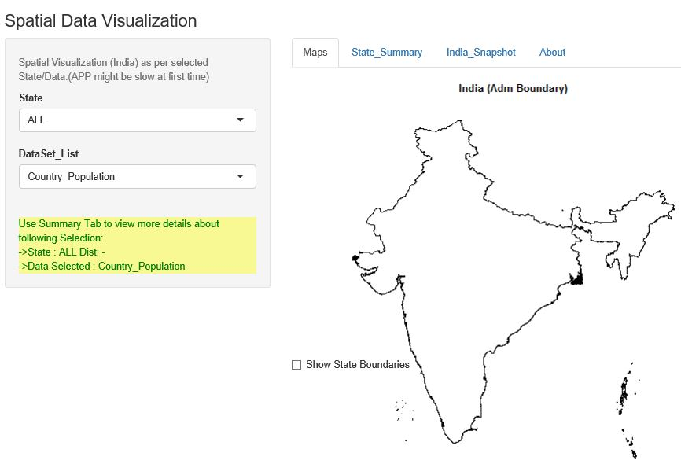

## Synopsis

- Dynamic and interactive spatial data visualization for India.
- Uses Shiny + 'R' to implement reactive programming model to achieve interactive plotting and
  rendering of related information.
- Data was sourced from GADM public data site as well as Indian government's public data site.
  ( see references on last slide )
- Due to RStudio's issues, this presentation was not run through its presenter and so the
  live application screens could not be captured while making this presentation. However,
  main screen as captured with snipping tool is included later in this presentation. Also
  the efforts to embed entire Shiny application inside RMarkdown and then running through
  Slidify also did not work well. Application size and features used could be issue there.
- Application is hosted at : 
- And GitHUB repo is here  :

---

## Data Product Design And Implementation

- All UI is dynamically rendered by the server through reactive functions in response to uiOutput from UI.
- Server does all the work, globals at Server level are used to read data in to global data frames.
- Spatial data is complex and often of large volume. 'R' provides excellent packages for such data
  through packages such as "sp", "spplot", "rgdal", "rgeos", "maptools" and others.
- Shape files are processed with readOGR, SpatialPolygonsDataFrame object is used to store spatial data.
- Please refer to gadm.org web site for very useful information about various GIS data formats and
  how to process them. They also maintain ".rds" files which can be directly read into R with readRDS function.
- Can be easily reproduced by downloading all code files (ui.R and server.R), "about.md" file and 
  total of 14 data files ( 10 files for shape data + 4 CSV files). All these data files are located in "data"
  sub folder of the GitHub Repo of this project. Point the R path to the folder where you downladed all
  these files using "setwd()" and then run the Shiny application as usual using "runApp()".

---

## Application Main Screen

---

## Reproducibility
   To reproduce this project on any local desktop, download these files:
   "ui.R", "server.R", "about.md" and following data files:<br\>
    [1]. all_india_PO_list_without_APS_offices_ver2_lat_long.csv<br\>
    [2]. India_Population_StateWise_2015.CSV<br\>
    [3]. India_Statewise_Econ_Data_2014.csv<br\>
    [4]. Recorded_Forest_Areas_in_States_and_UTs.csv<br\>
    [5]. The GADM files: 10 of them : IND_adm0\*\.\*  And IND_adm1\*\.\* <br\>

References :<br\>
   Indian Government Site ( For data ) : data.gov.in. <br\>
   Very comprehensive, popular GIS data site for all countries : gadm.org. <br\>
   GADM database also here: http://biogeo.ucdavis.edu/data/gadm2/shp/IND_adm.zip<br\>
- Lecture Videos/Notes :Developing Data Products Course,JHU,Coursera.  <br\>
\*\*
- >>Please provide the reference in case this work is to be used elsewhere in part or full, and
    acknowledge JHU Data Science, Coursera And this project.  Thanks.  <br\>
- ============================================================================================
